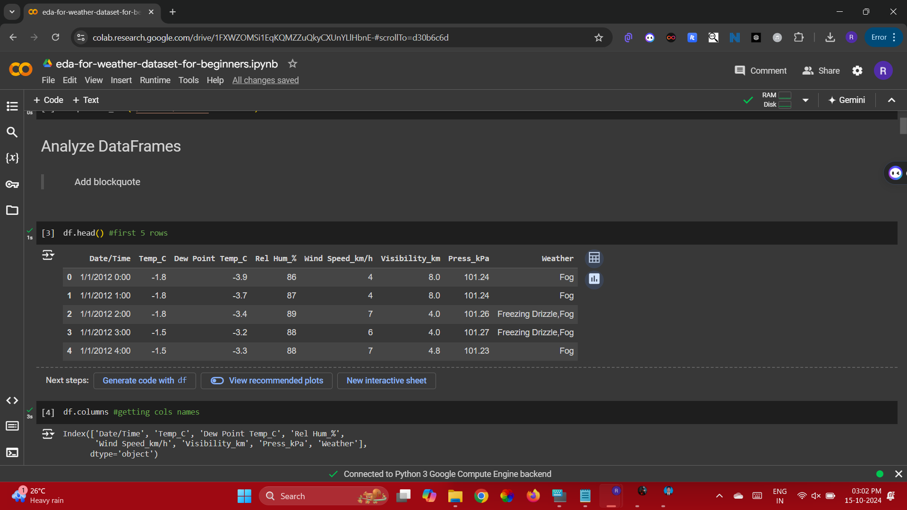
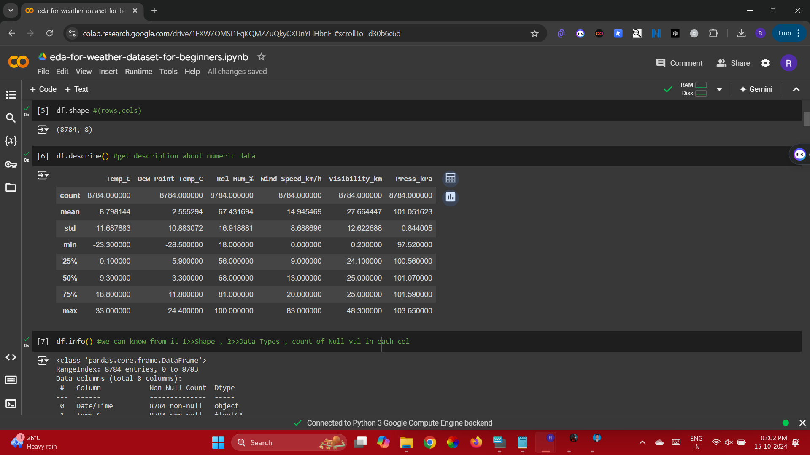
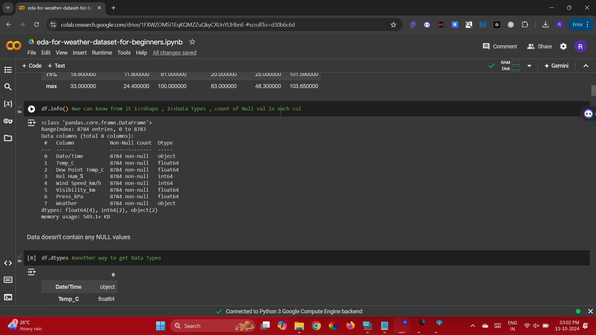
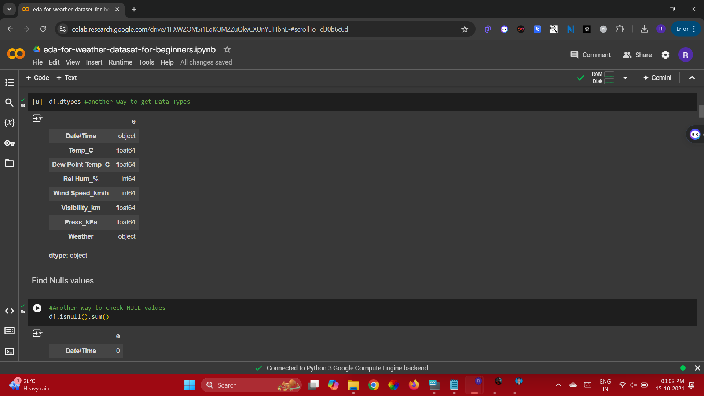
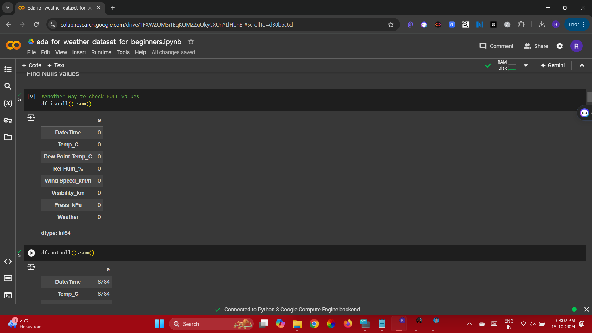
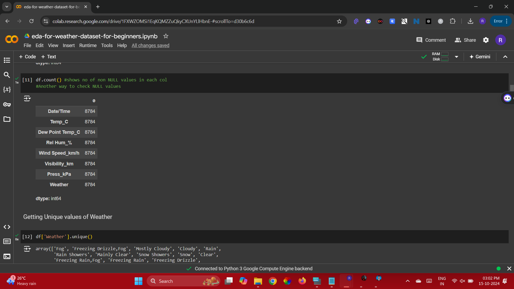
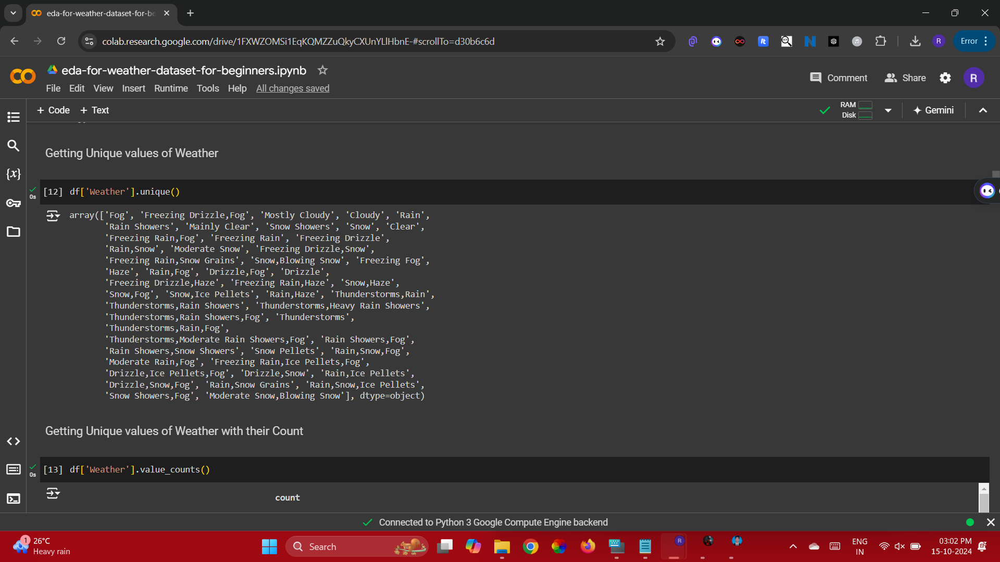
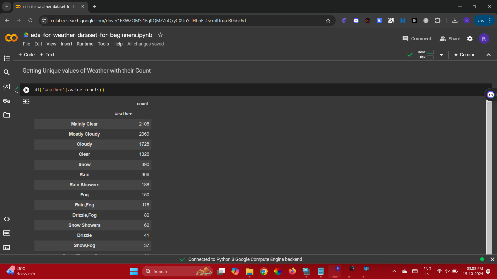
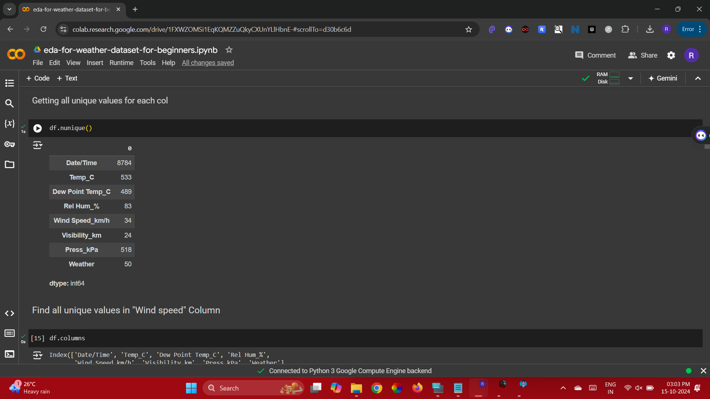
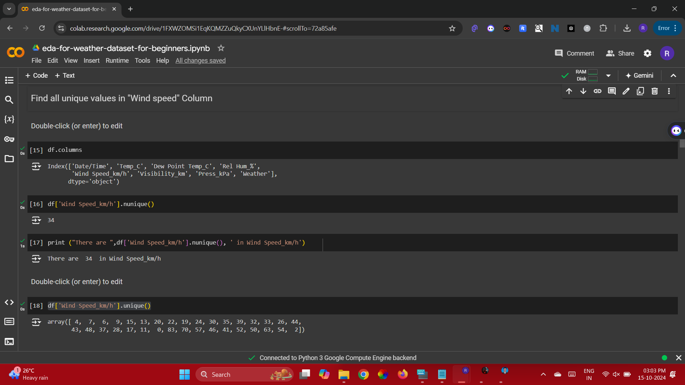

# Ex.No: 13 Learning – Use Supervised Learning(Miniproject)
## DATE:     
09/10/2024
## REGISTER NUMBER : 
212222040136
## AIM: 
To write a program to train the classifier for Diebetes.
##  Algorithm:
Step 1 : Start the program.<br>
Step 2 : Import the necessary packages, such as NumPy and Pandas.<br>
Step 3 : Install and import Gradio for creating the user interface.<br>
Step 4 : Load the diabetes dataset using Pandas.<br>
Step 5 : Split the dataset into input features (`x`) and target labels (`y`).<br>
Step 6 : Split the data into training and testing sets using `train_test_split`.<br>
Step 7 : Standardize the training and testing data using the `StandardScaler`.<br>
Step 8 : Instantiate the `MLPClassifier` model with 1000 iterations and train the model on the training data.<br>
Step 9 : Print the model's accuracy on both the training and testing sets.<br>
Step 10 : Define a function `diabetes` to take input values for diabetes features and predict the outcome using the trained model.<br>
Step 11 : Create an interactive Gradio interface for the diabetes detection system with text inputs for each feature and output as either "YES" or "NO" for the prediction.<br>
Step 12 : Launch the Gradio interface and share it for interaction.<br>
Step 13 : Stop the program.<br>
## Program:
Importing Libraries
```
import numpy as np 
import pandas as pd 
import os
for dirname, _, filenames in os.walk('/kaggle/input'):
    for filename in filenames:
        print(os.path.join(dirname, filename))
```
Reading Data
```
df=pd.read_csv("/content/Weather Data.csv")
```
Analyze DataFrames<br>

1
```
df.head() #first 5 rows
```
2
```
df.columns #getting cols names
```
3
```
df.shape #(rows,cols)
```
4
```
df.describe() #get description about numeric data
```
5
```
df.info() #we can know from it 1>>Shape , 2>>Data Types , count of Null val in each col
```
6
```
df.dtypes #another way to get Data Types
```

Find Nulls values<br>

7
```
#Another way to check NULL values
df.isnull().sum()
```
8
```
df.notnull().sum()
```
9
```
df.count() #shows no of non NULL values in each col
#Another way to check NULL values
```

Getting Unique values of Weather<br>

10
```
df['Weather'].unique()
```

Getting Unique values of Weather with their Count<br>

11
```
df['Weather'].value_counts()
```

Getting all unique values for each col<br>

12
```
df.nunique()
```

Find all unique values in "Wind speed" Column<br>

13
```
df.columns
```
14
```
df['Wind Speed_km/h'].nunique()
```
15
```
print ("There are ",df['Wind Speed_km/h'].nunique(), ' in Wind Speed_km/h')
```
16
```
df['Wind Speed_km/h'].unique()
```
## Output:






















## Result:
Thus the system was trained successfully and the prediction was carried out.
